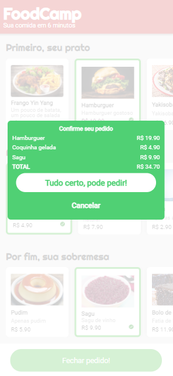

# :bento: ​Aplicativo mobile estilo Ifood

> Página desenvolvida utilizando **CSS**, **HTML** e **JavaScript**. 

> O projeto faz parte do bootcamp "Desenvolvimento Web Full-Stack" do **Responde Aí**

Acesse a página clicando **<a href="https://mateuskuritza.github.io/Projeto3_FoodCamp/">AQUI</a>**

​																									Preview do APP

#### :wrench: ​​Principais pontos: 

+ Foram utilizados ícones da biblioteca <a href="https://ionicons.com/">Ionicons</a>;

+ Lista de pedidos com scroll horizontal;

+ Barras do topo e inferior fixas;

+ Confirmação do pedido e encaminhamento do mesmo para o *whatsapp*.

##### :page_with_curl: ​Fontes úteis para o desenvolvimento desse projeto: 

> Para a organização do layout: <a href="https://css-tricks.com/snippets/css/a-guide-to-flexbox/">Flex-Box</a>

> Fixar elementos na tela: <a href="https://www.w3schools.com/css/css_positioning.asp">Position Fixed</a>

> Conhecimentos úteis do JavaScript: <a href="https://www.w3schools.com/jsref/met_document_queryselector.asp">.querySelector</a> e <a href="https://www.w3schools.com/js/js_this.asp">this</a>
